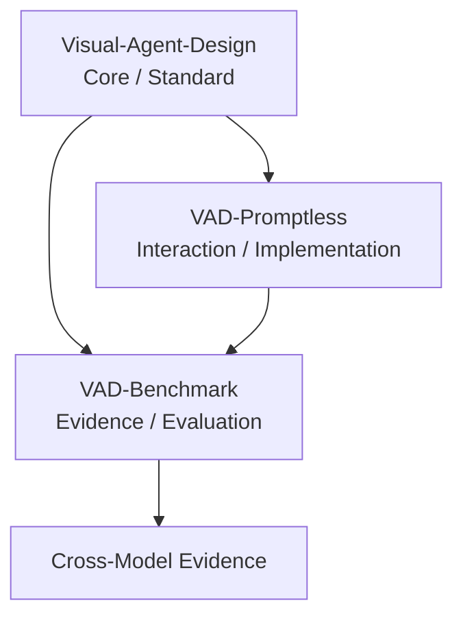

# VAD-Benchmark｜Visual Agent Design Evidence & Evaluation Lab

> **把 VAD 從方法論變成可重複驗證、跨模型比較、量化追蹤的證據系統。**

**版本：0.2.0**  
**階段：Five-Pack Pilot Lab**  
**定位：Cross-model Benchmark / Evaluation / Reproducibility / Human–AI Collaboration Research**

VAD-Benchmark 是 Visual Agent Design 生態系的 **Evidence Layer**。它不重新定義 VAD Core，也不複製 Promptless 實作；它用可重複的研究設計與工程化紀錄回答三個問題：VAD 是否提升任務品質？VAD-Promptless 是否降低提示詞與操作負擔？這些效果能否跨模型與跨任務被重複驗證？

## Ecosystem Role



- **Visual-Agent-Design**：TRC-3D、VAC-8、Five-Pack、VAD Agent Blueprint、Core QA / Research。
- **VAD-Promptless**：Zero Prompting、Self-Describing Visual Card、Machine Layer、Integrity。
- **VAD-Benchmark**：固定任務包、實驗條件、紀錄、評分、跨模型比較與可重現性。

> **Source-of-truth：VAD Core 只以上游 `draiagent/Visual-Agent-Design` 為準；Promptless 行為只以上游 `draiagent/VAD-Promptless` 為準。**

## v0.2.0｜Five-Pack Pilot Lab

v0.1.0 建立 Evidence / Evaluation Foundation；v0.2.0 開始建立真正可以重跑的 Pilot Task Packs。

| Task ID | Family | Upstream VAC | Pilot Fixture |
|---|---|---|---|
| `PILOT-VIDEO-001` | video | `VAC-VIDEO-001` | 固定逐字稿 + 固定 binary video |
| `PILOT-SLIDE-001` | slides | `VAC-SLIDE-001` | 合成教學 brief |
| `PILOT-WEB-001` | web | `VAC-WEB-001` | 虛構專案 brief |
| `PILOT-DATA-001` | data | `VAC-DATA-001` | 固定合成 CSV + dictionary |
| `PILOT-REPORT-001` | report | `VAC-REPORT-001` | 固定合成會議逐字稿 |

完整 Pilot 規則：[`PILOT-LAB.md`](PILOT-LAB.md)  
Task Pack 規格：[`tasks/README.md`](tasks/README.md)  
Condition freeze：[`conditions/PILOT-CONDITIONS.md`](conditions/PILOT-CONDITIONS.md)

## Benchmark Conditions

### VAD Track A–F

A 純文字 Prompt、B VAC、C VAC + minimal text、D 等資訊量文字 SOP、E decorative card、F TRC-3D + VAC + Agent。

### Promptless Track P0–P2

P0 傳統完整 Prompt、P1 Self-Describing Card + Zero-Prompt launch、P2 Self-Describing Card + minimal override。

兩條 Track 分開分析，避免把 VAD 視覺結構效果與 Promptless 互動成本效果混成同一個因果問題。

## Primary Metrics

Completion Rate、First-Pass Yield、Revision Count、Human Active Time、Agent Wait Time、Weighted Error (`Critical×5 + Major×3 + Minor`)、Consistency、Routing Accuracy、Prompt Characters / Turns、TUS-VA、HASTU、Satisfaction。

詳見 [`METRICS.md`](METRICS.md)。

## Reproducibility Contract

每次正式 run 至少保存 study/run ID、condition、task pack、模型指紋、VAD/Promptless commit SHA、工具權限、input hash、時間戳、raw interaction、驗收結果、錯誤數、人工/Agent 時間與 final status。**Raw results 不覆寫。**

## Pinned Baseline for v0.2.0

- Visual-Agent-Design: `9781df292270ec9c2abbec911d3263f245974fa7`
- VAD-Promptless: `304537ad22437050598a956bfab0ed24169452a4`

詳見 [`UPSTREAMS.md`](UPSTREAMS.md)。

## Quick Start

```bash
python -m pip install jsonschema

# v0.1 foundation compatibility
python scripts/validate_study.py --config configs/study-v0.1.0.json --run examples/sample-run.json

# v0.2 Pilot Lab
python scripts/validate_study.py --config configs/study-v0.2.0.json
python scripts/validate_task_packs.py --config configs/study-v0.2.0.json
python -m unittest discover -s tests -p 'test_*.py' -v

# Build a deterministic VAD pilot matrix without calling any model
python scripts/build_pilot_matrix.py \
  --track vad \
  --model provider:model:version:platform \
  --replicates 2 \
  --out /tmp/vad-pilot-matrix.json
```

## Visual Evidence

公開 Pilot 圖卡與研究簡報應遵循 [`visuals/PILOT-SCORECARD.md`](visuals/PILOT-SCORECARD.md)：先呈現比較條件、模型指紋、`n`、指標方向與限制，再呈現結果。Pilot 不使用「Best」「Winner」「Proven」等超出證據成熟度的字樣。

## Evidence Policy

不得捏造 benchmark 結果、不得用單一漂亮案例代表整體效果、不得把探索性 composite score 當成已驗證標準。跨模型比較必須揭露模型版本、工具權限與條件差異；能力不等價時標記 `capability_mismatch`。正式學術研究仍需依研究倫理、樣本數估算與統計分析計畫執行。

## License

MIT License。

> **VAD 定義工作；VAD-Promptless 降低啟動摩擦；VAD-Benchmark 建立可重跑的證據。**
