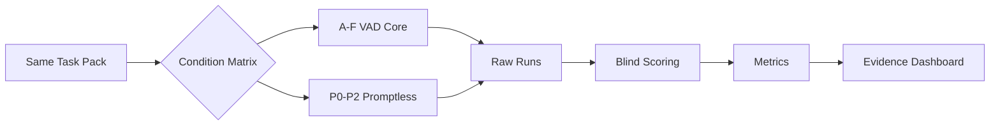

# VISUAL-EVIDENCE-SYSTEM.md｜Benchmark Visual Evidence System

VAD-Benchmark 的視覺輸出不是裝飾，而是要讓研究者、企業決策者與一般學習者快速看懂「條件、證據、限制」。

## Visual Hierarchy

每張 Benchmark Scorecard 固定四層：

1. **Context**：Task / Condition / Model / Version / Date
2. **Primary Outcomes**：Completion / FPY / Error / Human Time
3. **Interaction Outcomes**：Prompt burden / Revision / TUS-VA / HASTU
4. **Evidence Status**：n、variance、capability mismatch、protocol deviation

## GitHub-native Overview

## Scorecard Contract

任何公開圖卡或 dashboard 至少顯示：

- study ID / task / condition
- model fingerprint
- sample size `n`
- primary metrics
- benchmark version
- upstream refs
- limitation badge（如 capability mismatch）

不得只顯示「總分」而隱藏樣本數與主要錯誤。

## Comparison Layout

建議固定使用三種視覺：

- **Model × Condition Matrix**：比較跨模型與條件。
- **Task Scorecard**：單一任務的 completion / error / time / prompt burden。
- **Evidence Ladder**：Pilot → Replicated → Cross-model → Cross-task → External replication。

## Design Direction

公開教材採高可讀性的 research-tech 風格：深藍資訊層級、青綠重點、白色背景、大量留白、明確數字與可信度標示。視覺不應使用會暗示「勝負」但缺乏統計支持的誇張元素。

## Evidence Badges

- `PILOT`：小樣本探索。
- `REPLICATED`：相同 protocol 已重複。
- `CROSS-MODEL`：至少兩種模型/平台完成等價比較。
- `CROSS-TASK`：至少三類 task family。
- `EXTERNAL`：由外部團隊重現。

Badge 只表示證據成熟度，不表示方法一定有效。
